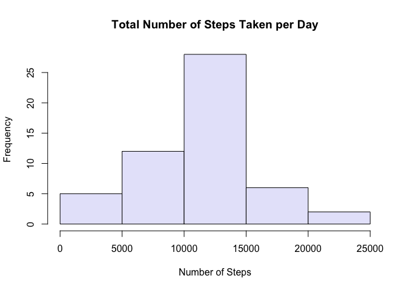
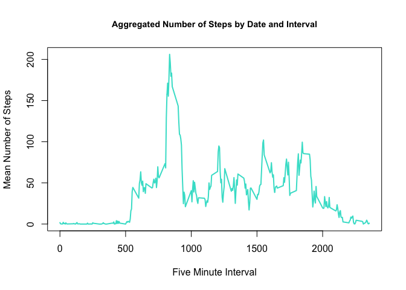
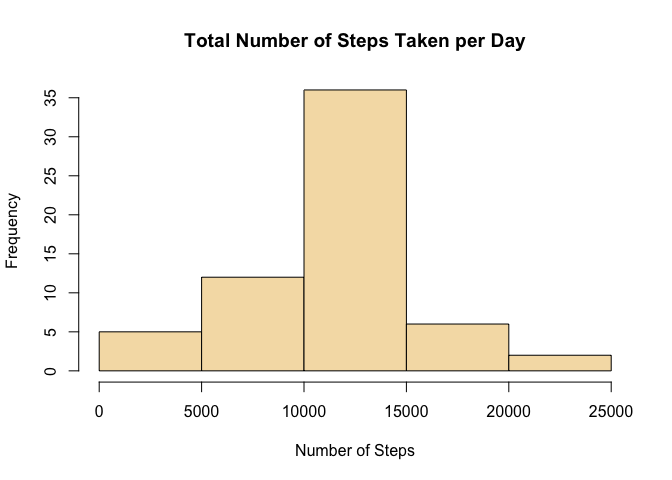
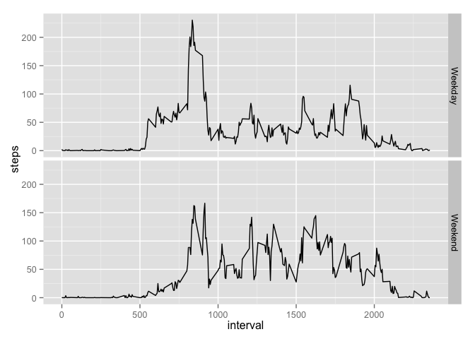

# PA1_template
October 16, 2015  
## The Assignment

This assignment makes use of data from a personal activity monitoring device. This device collects data at 5 minute intervals through out the day. The data consists of two months of data from an anonymous individual collected during the months of October and November, 2012, and include the number of steps taken in 5 minute intervals each day.

The variables included in this dataset are:
    * steps: Number of steps taking in a 5-minute interval (missing values are coded as NA) 
    * date: The date on which the measurement was taken in YYYY-MM-DD format 
    * interval: Identifier for the 5-minute interval in which measurement was taken

The dataset is stored in a comma-separated-value (CSV) file and there are a total of 17,568 observations in this dataset.

## Loading and Processing the Data
The following commands assume that the file activity.csv is stored in the current working directory for R.


```r
activity <- read.csv(file="activity.csv",colClasses=c("numeric","Date",NA),header=TRUE)
str(activity)
```

```
## 'data.frame':	17568 obs. of  3 variables:
##  $ steps   : num  NA NA NA NA NA NA NA NA NA NA ...
##  $ date    : Date, format: "2012-10-01" "2012-10-01" ...
##  $ interval: int  0 5 10 15 20 25 30 35 40 45 ...
```
The str function reveals that three variables, steps (class numeric), date (class Date), and interval (class integer - NA means 'read in class as is'), have been read into R. There are 17568 observations, as mentioned in the original assignment statement.

## Mean total number of steps taken per day
1. Calculate the total number of steps taken per day 
2. Make a histogram of the total number of steps taken each day 
3. Calculate and report the mean and median of the total number of steps taken per day

The following code chuck answers these questions:

```r
library(dplyr) # Load dplyr library to use aggregate()
```

```
## 
## Attaching package: 'dplyr'
## 
## The following objects are masked from 'package:stats':
## 
##     filter, lag
## 
## The following objects are masked from 'package:base':
## 
##     intersect, setdiff, setequal, union
```

```r
# Calculate total steps per day
dailyTotal <- aggregate(steps~date,data=activity,FUN=sum) 
# Obtain histogram of total number of steps
hist(dailyTotal$steps,xlab="Number of Steps",main="Total Number of Steps Taken per Day",col="lavender")
```

 

```r
# Calculate mean and median total steps per day
mean(dailyTotal$steps) # Mean of total number of steps
```

```
## [1] 10766.19
```

```r
median(dailyTotal$steps) # Median of total number of steps
```

```
## [1] 10765
```

```r
# And then I created a data frame with total, mean, and median steps for each day
dailyMean <- aggregate(steps~date,data=activity,FUN=mean)
dailyMedian <- aggregate(steps~date,data=activity,FUN=median)
# Make sure that column names for statistics are distinct
names(dailyTotal) <- c("Date","TotalSteps")
names(dailyMean) <- c("Date","MeanSteps")
names(dailyMedian) <- c("Date","MedianSteps")
dailyStats <- merge(dailyTotal,dailyMean) # Merge total and mean
dailyStats <- merge(dailyStats,dailyMedian) # Merge result with median
head(dailyStats)
```

```
##         Date TotalSteps MeanSteps MedianSteps
## 1 2012-10-02        126   0.43750           0
## 2 2012-10-03      11352  39.41667           0
## 3 2012-10-04      12116  42.06944           0
## 4 2012-10-05      13294  46.15972           0
## 5 2012-10-06      15420  53.54167           0
## 6 2012-10-07      11015  38.24653           0
```
**Conclusion:** The mean daily total steps is 10766 and the median is 10765.

## Average daily activity pattern
1. Make a time series plot (i.e. type = "l") of the 5-minute interval (x-axis) and the average number of steps taken, averaged across all days (y-axis)
2. Which 5-minute interval, on average across all the days in the dataset, contains the maximum number of steps?

Aggregation of steps by interval and day is the objective of this section of the assignment. The code below takes the original data frame (activity), groups it by interval and date, takes the mean of steps by date, and then takes the mean of that result by interval. The result is a 288 by 2 data frame with the average number of steps for each interval and day combination. NAs are removed in the calculation.

```r
aggData <- activity %>% 
      group_by(interval,date) %>% 
          summarise(steps_by_Date = mean(steps, na.rm=T)) %>% 
              summarise(steps=mean(steps_by_Date,na.rm=T)) 
## Create the time series plot
plot(aggData$interval,aggData$steps, type="l",col="turquoise",lwd=2,xlab="Five Minute Interval",ylab="Mean Number of Steps",main="Aggregated Number of Steps by Date and Interval",cex.main=0.9)
```

 

```r
# Find the interval where the maximum number of steps occurs:
aggData[which.max(aggData$steps),]
```

```
## Source: local data frame [1 x 2]
## 
##   interval    steps
##      (int)    (dbl)
## 1      835 206.1698
```
**Conclusion:** Activity is almost non-existent in the early morning hours, when most people are asleep. Activity levels begin to rise shortly after 5:00 a.m. and continue until a peak at 8:30. Then activity levels sharply drop until mid-afternoon. There is a more or less steady state of activity until 8:00 p.m. Activity levels taper off to zero after that. The interval with the most activity is between 8:30 and 8:35 in the morning.

## Imputing missing values
Note that there are a number of days/intervals where there are missing values (coded as NA). The presence of missing days may introduce bias into some calculations or summaries of the data.
1. Calculate and report the total number of missing values in the dataset (i.e. the total number of rows with NAs)
2. Devise a strategy for filling in all of the missing values in the dataset. The strategy does not need to be sophisticated. For example, you could use the mean/median for that day, or the mean for that 5-minute interval, etc.
3. Create a new dataset that is equal to the original dataset but with the missing data filled in.
4. Make a histogram of the total number of steps taken each day and calculate and report the mean and median total number of steps taken per day. Do these values differ from the estimates from the first part of the assignment? What is the impact of imputing missing data on the estimates of the total daily number of steps?


```r
# How many rows contain missing values for the number of steps?
dim(activity[is.na(activity$steps),])
```

```
## [1] 2304    3
```

```r
# The total number of NAs is 2304.
# Merge the aggregated data with original activity data to fill in missing values
# First, give the variable 'steps' in aggData a unique name
names(aggData)[2] <- "meanSteps"
ImputedData <- merge(activity,aggData,by="interval")
# Replace NA values in 'steps' variable with means from 'meanSteps'
ImputedData$steps[is.na(ImputedData$steps)] <-  
           ImputedData$meanSteps[is.na(ImputedData$steps)]
# Calculate total steps per day and obtain histogram
impTotal <- aggregate(steps~date,data=ImputedData,FUN=sum) 
hist(impTotal$steps,xlab="Number of Steps",main="Total Number of Steps Taken per Day",col="wheat")
```

 

```r
# Calculate mean and median total steps per day
mean(impTotal$steps) # Mean of total number of steps
```

```
## [1] 10766.19
```

```r
median(impTotal$steps) # Median of total number of steps
```

```
## [1] 10766.19
```
**Conclusion:** The mean and median total steps are both 10766 for the imputed data. For the non-imputed data, the mean and median were 10766 and 10765, respectively. Therefore, there is not a great deal of impact in imputing the missing values on the mean and median. This is probably because I chose to use the mean of each day and interval as the imputed value. I suspect that a more sophisticated method of imputation would result in a greater difference. The imputation seems to shift the total number of steps slightly to the right. The middle peak of the histogram has more values in it for the imputed data than it did for the non-imputed data.

## Activity patterns for weekdays versus weekends
For this part the weekdays() function may be of some help here. Use the dataset with the filled-in missing values for this part.
1. Create a new factor variable in the dataset with two levels – “weekday” and “weekend” indicating whether a given date is a weekday or weekend day.
2. Make a panel plot containing a time series plot (i.e. type = "l") of the 5-minute interval (x-axis) and the average number of steps taken, averaged across all weekday days or weekend days (y-axis). See the README file in the GitHub repository to see an example of what this plot should look like using simulated data.


```r
# Create days of week variable (dayofWeek) from dates given and use grepl to find Saturday and Sunday. Then convert the resulting logical into a factor variable with two levels (weekday and weekend).
actData <- mutate(ImputedData, dayofWeek = weekdays(date))
actData <- mutate(actData, dayType = grepl('^S',actData$dayofWeek))
actData$dayType <- ifelse(actData$dayType==TRUE, "Weekend", "Weekday")
actData$dayType <- as.factor(actData$dayType)
# Find mean values by interval and date and then plot the data in a panel plot.
aggImpData <- actData %>% 
      group_by(interval,dayType,date) %>% 
          summarise(steps_by_Date = mean(steps)) %>% 
              summarise(steps=mean(steps_by_Date)) 
library(ggplot2)
ggplot(data=aggImpData, aes(interval, steps)) +geom_line() + facet_grid(dayType ~ .)
```

 

**Conclusion:** There are differences in activity patterns for weekdays and weekends. For weekdays, activity peaks around 8:30 in the morning and then plateaus for the rest of the day. There is a slight increase in activity around 8:00 p.m. For weekends, activity also peaks between 8 and 9 in the morning, but the peak is not as high as it is for weekdays. The activity throughout the day stays at a higher level than does the activity during weekdays. Activity also ceases later on the weekends than it does on weekdays.
